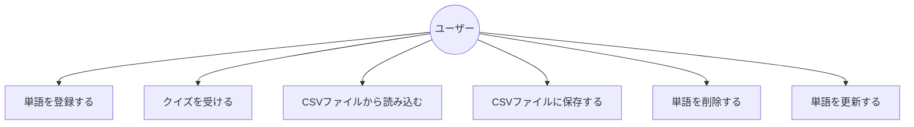

# 要件定義書

## 1. システム概要

このプログラムは英単語を勉強する時に使います。
英単語と日本語訳を登録して、クイズができます。
登録した単語をデータベースに保存し、管理することができます。

## 2. 機能要件

1. 単語登録機能
   - 英単語と日本語訳を登録できます。
   - CSVファイルから一括登録できます。
   - 一度に1つずつ単語を登録できます。
   - 登録時に入力チェックを行います。

2. クイズ機能
   - ランダムに単語が出題されます。
   - 正解数と総問題数が表示されます。
   - 不正解の場合は正解を表示します。

3. データ管理機能
   - 登録した単語をCSVファイルに保存できます。
   - 保存したデータを読み込めます。
   - 登録した単語はデータベースに自動保存されます。
   - 単語の一覧表示ができます。
   - 単語の削除ができます。
   - 単語の更新ができます。

## 3. 非機能要件

1. 使いやすさ
   - シンプルなメニュー構成です。
   - 分かりやすい日本語表示です。
   - エラー時は適切なメッセージを表示します。

2. 性能
   - データベースへの即時アクセスを実現します。
   - 最大1000単語まで管理できます。

3. 信頼性
   - データベース接続エラー時の適切なエラーハンドリング
   - 入力値の検証による不正データの排除

4. セキュリティ
   - データベースへのアクセスは認証必須
   - 接続情報は適切に管理（任意）

## 4. ユースケース図

