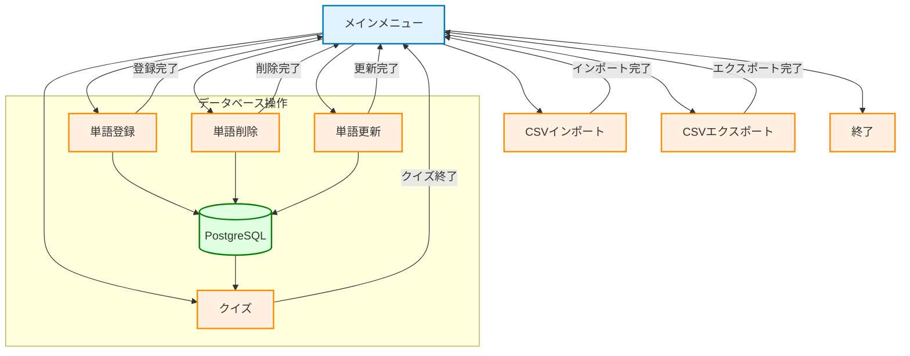

# 画面遷移図

```mermaid
graph TD
    A[メインメニュー] --> B[単語登録]
    A --> C[クイズ]
    A --> D[CSVインポート]
    A --> E[CSVエクスポート]
    A --> G[単語削除]
    A --> H[単語更新]
    A --> F[終了]

    B --> |登録完了|A
    C --> |クイズ終了|A
    D --> |インポート完了|A
    E --> |エクスポート完了|A
    G --> |削除完了|A
    H --> |更新完了|A

    subgraph データベース操作
        B --> DB[(PostgreSQL)]
        G --> DB
        H --> DB
        DB --> C
    end

    %% スタイル設定
    classDef default fill:#f9f9f9,stroke:#333,stroke-width:2px;
    classDef menu fill:#e1f3ff,stroke:#0077be,stroke-width:2px;
    classDef action fill:#fff0e1,stroke:#ff8c00,stroke-width:2px;
    classDef database fill:#e1ffe1,stroke:#008000,stroke-width:2px;
    
    class A menu;
    class B,C,D,E,F,G,H action;
    class DB database;
```
