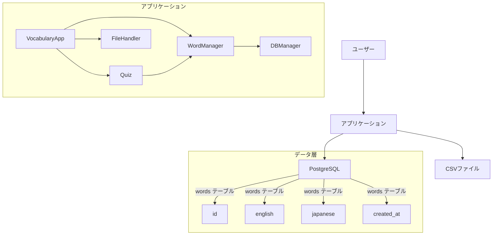

# システム構成図

```mermaid
graph TD
    A[ユーザー] --> B[アプリケーション]
    B --> C[PostgreSQL]
    B --> D[CSVファイル]
    
    subgraph アプリケーション
        E[VocabularyApp]
        F[WordManager]
        G[Quiz]
        H[FileHandler]
        I[DBManager]
        
        E --> F
        E --> G
        E --> H
        F --> I
        G --> F
    end
    
    subgraph データ層
        C --> |words テーブル| J[id]
        C --> |words テーブル| K[english]
        C --> |words テーブル| L[japanese]
        C --> |words テーブル| M[created_at]
    end
```
